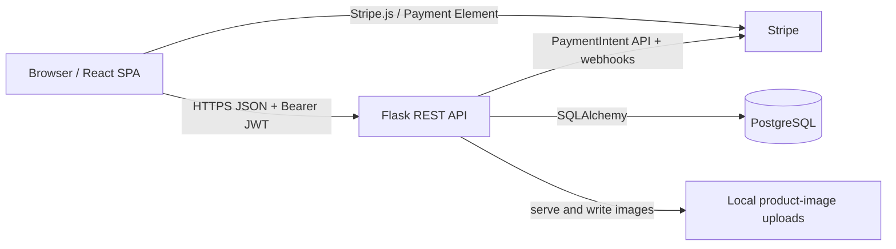
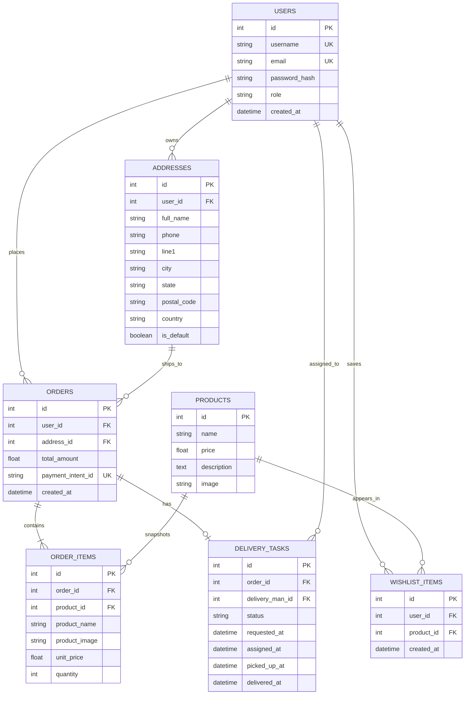
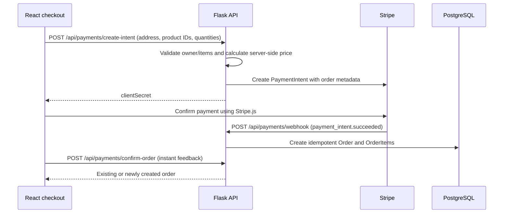

# E-Shop Architecture

## Purpose

E-Shop is a single-page ecommerce application. Customers can browse and search a product catalogue, manage a local cart, register and sign in, store delivery addresses, maintain a wishlist, pay through Stripe, and view orders. Administrators manage products, uploaded product images, reporting, and delivery assignments. Delivery personnel request, accept, and progress delivery tasks.

## System overview



The frontend is built and served separately from the Flask API. `VITE_API_URL` supplies the API origin to the browser; an empty value supports a same-origin deployment. The backend reads its database connection from `DATABASE_URL` and uses SQLAlchemy migrations managed by Alembic.

## Frontend

**Technology:** React 19, Vite, React Router, Stripe React SDK, and plain CSS.

`Frontend/src/main.jsx` boots the app. `App.jsx` owns the router, shared header/navigation, and client-side role gates. UI is organised into:

- `pages/`: catalogue, product details, search results, cart, authentication, profile, checkout, admin, admin delivery, and delivery dashboard views.
- `components/`: reusable product card, cart items/button, and image uploader.
- `context/AuthContext.jsx`: restores and stores the JWT in `localStorage`, fetches the current user, and exposes login, registration, and logout actions.
- `context/CartContext.jsx`: keeps the cart in React state and persists it in `localStorage`. It is intentionally client-side until checkout.
- `api.js`: the API boundary. It supplies the Bearer token for protected JSON requests and contains all product, profile, payment, upload, admin, and delivery calls.

### Routes and access

| Route | View | Client-side access |
| --- | --- | --- |
| `/`, `/search`, `/product/:id`, `/cart` | shopping views | public |
| `/login`, `/register` | authentication | public |
| `/profile`, `/checkout` | account and purchase | signed-in user expected |
| `/admin`, `/admin/delivery` | product/admin and delivery operations | `user.is_admin` |
| `/delivery-dashboard` | delivery workflow | `user.role === 'delivery_man'` |

These UI gates are for navigation and usability; the Flask decorators are the authoritative authorization layer.

## Backend

**Technology:** Flask 3, Flask-SQLAlchemy, Flask-Migrate/Alembic, PyJWT, bcrypt, Stripe SDK, PostgreSQL driver, and Gunicorn for production process hosting.

`Backend/app.py` is the composition root. It loads environment configuration, creates the Flask application, enables CORS, initializes the database and migrations, and registers the blueprints below.

| Blueprint/module | Responsibility |
| --- | --- |
| `routes/auth.py` | Registration, login, current-user endpoint |
| `routes/products.py` | Public catalogue/search and admin product CRUD |
| `routes/profile.py` | Profile, address, wishlist, and legacy direct-order endpoints |
| `routes/payment.py` | Stripe PaymentIntent creation, webhook fulfilment, order confirmation |
| `routes/upload.py` | Admin product image upload and static image delivery |
| `routes/admin.py` | Admin reporting/dashboard |
| `routes/delivery.py` | Delivery-person requests/statuses and admin assignment/oversight |
| `auth.py` | JWT creation/validation and reusable role decorators |
| `model.py` | SQLAlchemy models and serialization helpers |

### Authorization model

Passwords are hashed with bcrypt. A successful login or registration returns a JWT which the client sends as `Authorization: Bearer <token>`. The user’s effective role is one of `customer`, `admin`, or `delivery_man`.

- `token_required`: any authenticated user.
- `admin_required`: admin only.
- `delivery_man_required`: delivery personnel only.
- `delivery_or_admin_required`: shared delivery/admin operations where required.

The first registered user is promoted to admin by the registration route. This is convenient during bootstrap but should be treated as a deployment-sensitive behaviour.

## Data architecture



`OrderItem` deliberately snapshots product name, image, and unit price, so historical orders remain accurate when a product later changes. `wishlist_items` has a unique `(user_id, product_id)` constraint; `payment_intent_id` is unique, which supports idempotent order creation.

## Main workflows

### Browse and manage products

1. Public pages call `GET /api/products`, `GET /api/products/search`, or `GET /api/products/:id`.
2. Search supports query, category, sorting, and pagination.
3. An admin uses protected `POST`, `PUT`, and `DELETE /api/products` endpoints. An image can first be uploaded through `POST /api/upload/product-image`; its returned URL is stored on the product.

### Authentication and profile

1. `POST /api/auth/register` or `POST /api/auth/login` returns the user and JWT.
2. The frontend persists the JWT then restores the session with `GET /api/auth/profile` on startup.
3. Authenticated profile endpoints manage addresses and wishlist entries. The cart remains browser-local, rather than being persisted in the database.

### Checkout and payment



The payment routes calculate totals from database product prices rather than trusting client prices. The webhook is the durable fulfilment path; `confirm-order` verifies the PaymentIntent and is idempotent so it can safely race with the webhook.

### Delivery lifecycle

```text
requested → assigned → picked_up → delivered
     └──────────────→ rejected
```

A delivery person sees eligible orders, creates a `requested` task, and then can advance an assigned task from `assigned` to `picked_up` to `delivered`. An admin can approve, reject, directly assign, inspect tasks/orders/delivery personnel, or override a task status. Timestamps capture each status transition.

## API groups

| Prefix | Consumers | Purpose |
| --- | --- | --- |
| `/api/auth` | public/authenticated | register, login, session profile |
| `/api/products` | public/admin | list, search, detail, product CRUD |
| `/api/profile`, `/api/orders` | authenticated | account data, addresses, wishlist, legacy orders |
| `/api/payments` | authenticated/Stripe | PaymentIntent, confirmation, webhook |
| `/api/upload` | admin | product-image upload |
| `/api/admin` | admin | dashboard and delivery administration |
| `/api/delivery` | delivery personnel | available orders, task requests, task progression |

## Deployment configuration

Keep these values server-side except for the Vite-prefixed browser settings:

| Variable | Used by | Notes |
| --- | --- | --- |
| `DATABASE_URL` | Flask/SQLAlchemy | PostgreSQL connection string |
| `JWT_SECRET_KEY` | Flask JWT signing | required strong secret in production |
| `STRIPE_SECRET_KEY` | Flask payment service | Stripe secret key |
| `STRIPE_WEBHOOK_SECRET` | Flask webhook | enables Stripe signature verification |
| `PORT` | Flask/Gunicorn | backend listener port |
| `VITE_API_URL` | React browser app | backend origin, intentionally public |
| `VITE_STRIPE_PUBLISHABLE_KEY` | React checkout | Stripe public key, intentionally public |

For production, host the static Vite build behind HTTPS, expose the Flask API behind HTTPS, set a specific CORS allowlist instead of unrestricted CORS, run `flask db upgrade` during deployment, and configure Stripe’s webhook endpoint to reach `/api/payments/webhook`.

## Repository layout

```text
Ecommerce-App/
├── Frontend/                # React/Vite application
│   └── src/
│       ├── components/      # reusable presentational UI
│       ├── context/         # auth and persisted cart state
│       ├── pages/           # route-level screens
│       ├── api.js           # HTTP client boundary
│       └── App.jsx          # layout and route wiring
├── Backend/                 # Flask application
│   ├── routes/              # HTTP controllers by business capability
│   ├── migrations/          # Alembic schema history
│   ├── app.py               # application factory/bootstrap
│   ├── auth.py              # auth/role policies
│   └── model.py             # persistence model
└── .env                     # local secrets/configuration; never commit
```
